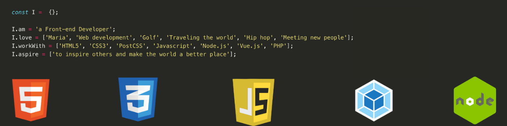

## Hi there 👋

My name is Wesley, I am a Senior Front-end Developer with a hidden side-love for digital marketing.

My web journey began all the way back in 2006 when I was 13-years old and started a small gig doing SEO work for websites. I’d optimise the metadata, the texts, and do some link building. This got me interested in websites and by 2007 I was building my own websites and experimenting with Affiliate Marketing and Google Adsense.

Fast-forward to 2014 where I started my first job for an employer as a Front-end Developer at Divide. Here I spend a little under 5-years building E-commerce sites for Fashion Retail brands and thinking of ways to make their websites more user-friendly, rank higher and have better conversion rates. After working on dozens and dozens of projects, I wanted a chance of dedicating myself to a single project, and I started working at Nature.House in the summer of 2019 as a Senior Front-end Web Developer. I work with a remarkable team of people making the application a bit better every single day.

## My Skills

More skills

 

### Code

### Frameworks

### Testing

### Tools

### Marketing

### Processes

### Other

## Connect with me

## My 5 latest blog posts
<!-- BLOG-POST-LIST:START -->
- [7 Goals To Grow My Content Creation This Month](https://medium.com/new-writers-welcome/7-goals-to-grow-my-content-creation-this-month-f87c2506a8d8?source=rss-8ddf286623e4------2)
- [October Income Report: Huge increase in Medium Earnings](https://medium.com/new-writers-welcome/october-income-report-huge-increase-in-medium-earnings-9d7906aa8a21?source=rss-8ddf286623e4------2)
- [9 Amazing Visual Studio Code Extensions To Skyrocket Productivity](https://javascript.plainenglish.io/9-amazing-visual-studio-code-extensions-to-skyrocket-productivity-f281f7827b53?source=rss-8ddf286623e4------2)
- [The Unexpected Story of My First Three-Figure Medium Article](https://medium.com/illumination/the-unexpected-story-of-my-first-three-figure-medium-article-60deac6e997b?source=rss-8ddf286623e4------2)
- [How To Convert Text to Speech With JavaScript](https://blog.bitsrc.io/how-to-convert-text-to-speech-with-javascript-310d890bcbb9?source=rss-8ddf286623e4------2)
<!-- BLOG-POST-LIST:END -->

Want to know more about me? Check out my [website](https://wesleysmits.com/) or follow me on [Medium](https://medium.com/@WesleySmits) or [Twitter](https://twitter.com/iamwesleysmits)!

